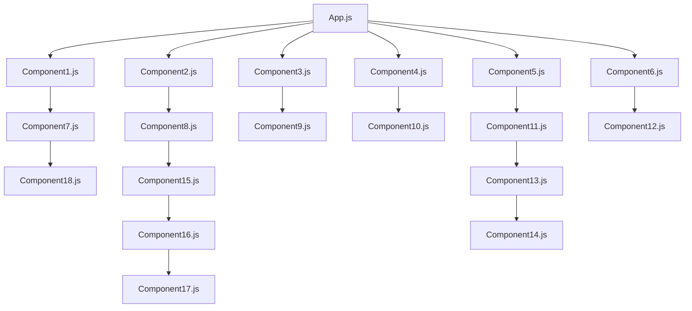

## Prompt drilling

Prompt drilling means if need to pass a state form app.js to component15.js then we would need to pass to component2.js then component8.js then finally to component15.js

```mermaid
graph TD
    App[App.js]

    App --> C1[Component1.js]
    App --> C2[Component2.js]
    App --> C3[Component3.js]
    App --> C4[Component4.js]
    App --> C5[Component5.js]
    App --> C6[Component6.js]

    C1 --> C7[Component7.js]
    C7 --> C18[Component18.js]

    C2 --> C8[Component8.js]
    C8 --> C15[Component15.js]
    C15 --> C16[Component16.js]
    C16 --> C17[Component17.js]

    C3 --> C9[Component9.js]

    C4 --> C10[Component10.js]

    C5 --> C11[Component11.js]
    C11 --> C13[Component13.js]
    C13 --> C14[Component14.js]

    C6  --> C12[Component12.js]
```